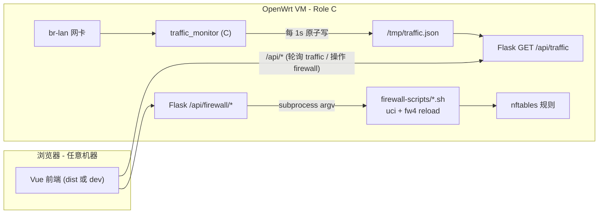
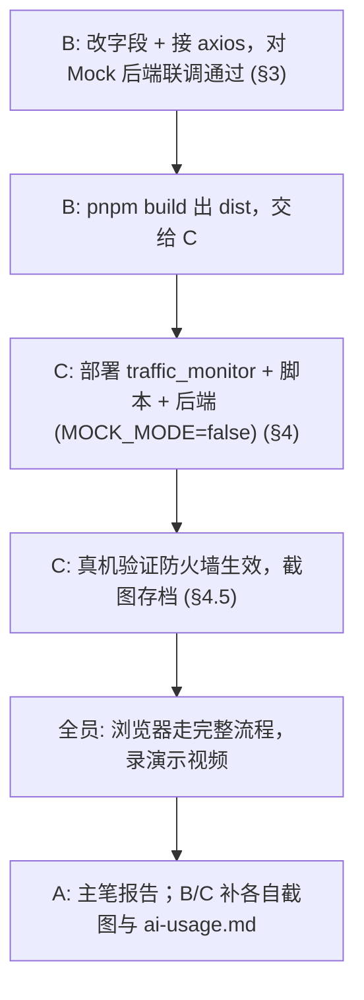

# 对接说明：Role A → Role B / Role C

> 作者：Role A（WSL2 主开发）。本文件是 A 把后端 / C 程序 / 防火墙脚本交付给队友联调、上线时的"操作手册"。一份文档同时面向 Role B（Vue 前端）和 Role C（VMware/OpenWrt）。
>
> 配套文档：API 契约 [docs/api.md](api.md)、环境信息 [docs/env.md](env.md)、二进制部署 [release/README.md](../release/README.md)、防火墙脚本与真机验证 [firewall-scripts/README.md](../firewall-scripts/README.md)。

---

## 0. A 的代码完成度（先回答"我是不是写完了"）

**结论：A 的编码任务（Phase 0-3）已基本全部完成并推送到 `main`。** 剩下的都是"联调 + 上线 + 报告"，需要 B/C 介入。

| 模块 | 状态 | 位置 |
|---|---|---|
| 仓库基建（README/.gitignore/.gitattributes/目录） | 完成 | 仓库根 |
| API 契约 v1 | 完成 | [docs/api.md](api.md) |
| Flask 后端（health/traffic/firewall 共 5 接口，CORS，Mock+真实双模式） | 完成 | [backend/](../backend/) |
| C 流量监控（libpcap，五元组，2s/10s/40s 滑动窗口，原子写 JSON） | 完成 | [traffic-monitor/](../traffic-monitor/) |
| OpenWrt 交叉编译产物（musl x86_64，已 strip，libpcap 静态） | 完成 | [release/traffic_monitor](../release/traffic_monitor) |
| 防火墙脚本（uci+fw4，增删查清） | 完成 | [firewall-scripts/](../firewall-scripts/) |
| 后端测试（51 passed：mock + 真实分支 + 安全用例 + JSON schema） | 完成 | [test/](../test/) |
| 部署脚本 / 打包脚本 | 完成 | [scripts/](../scripts/) |

**还没做的（Phase 4，依赖 B/C）：**

- 前端真正接通后端（**目前前端字段不匹配且未发请求，见 §3**）—— Role B
- 真机部署 + 防火墙生效验证 + 演示视频 —— Role C
- 实验报告、`docs/ai-usage.md`（三人各写各的部分）

---

## 1. 系统架构与数据流



- **开发期**：前端在 B 的机器上跑 `pnpm dev`，通过 Vite proxy 把 `/api/*` 转到 A 的 WSL2（或任何跑着 Flask 的机器）。后端 `MOCK_MODE=true`，B 不依赖 OpenWrt 就能联调。
- **上线期**：所有进程跑在 C 的 OpenWrt VM 上，后端 `MOCK_MODE=false`，读真实 `/tmp/traffic.json` 和真实防火墙。

---

## 2. 接口速查（B/C 共用，权威版在 docs/api.md）

| 方法 | 路径 | 用途 | 关键返回 |
|---|---|---|---|
| GET | `/api/health` | 健康检查 | `{ok, ts, mockMode, version}` |
| GET | `/api/traffic` | 流量快照（前端每 1.5s 拉一次） | `{ok, ts, items:[...]}` |
| GET | `/api/firewall/rules` | 规则列表 | `{ok, ts, rules:[...]}` |
| POST | `/api/firewall/rules` | 增规则 | `{ok, ruleId, stdout, stderr, code}` |
| DELETE | `/api/firewall/rules/<id>` | 删规则 | `{ok, stdout, stderr, code}`；不存在 404 |
| POST | `/api/firewall/clear` | 清空 | `{ok, stdout, stderr, code}` |

请求/响应字段务必以 [docs/api.md](api.md) 为准。任何字段要改，先改 api.md 再改代码，三人 review。

---

## 3. 给 Role B（Vue 前端）

### 3.1 起步（在你的开发机）

```bash
git pull origin main
cd frontend
pnpm install          # package.json 已含 vue/element-plus/echarts/axios/pinia/vue-router
pnpm dev              # 默认 http://localhost:5173
```

后端怎么来（二选一）：

- **A 帮你开**：A 在 WSL2 跑 `MOCK_MODE=true python app.py`，把 WSL2 IP 告诉你，你把 [frontend/vite.config.js](../frontend/vite.config.js) 里 proxy 的 `target` 改成 `http://<A的WSL2 IP>:5000`。
- **你自己开**（推荐，最省事）：本机装 Python，按 §5 起一个 `MOCK_MODE=true` 的后端，`target` 保持 `http://localhost:5000`。

> Vite proxy 已配好 `/api → localhost:5000`，所以前端代码里所有请求**写相对路径 `/api/xxx`**，不要写死 IP，生产环境同源部署才不会出问题。

### 3.2 ⚠️ 必须修复：字段名与 API 契约不一致

当前 [frontend/src/views/TrafficMonitor.vue](../frontend/src/views/TrafficMonitor.vue) 和 [frontend/src/views/FirewallConfig.vue](../frontend/src/views/FirewallConfig.vue) 用的字段名跟后端**对不上**，而且按钮只 `console.log`、还没发请求。直接连后端会全是空表。请按下表改。

**流量表 / 图表字段（TrafficMonitor.vue）：**

| 你现在用的 | 后端实际返回 | 含义 |
|---|---|---|
| `protocol` | `proto` | 协议 tcp/udp/icmp/other |
| `src_ip` | `srcIp` | 源 IP |
| `dst_ip` | `dstIp` | 目的 IP |
| `src_port` | `srcPort` | 源端口 |
| `dst_port` | `dstPort` | 目的端口 |
| `bytes` | `rxBytes` / `txBytes` | 收/发累计字节（**两个字段**） |
| `packets` | （无此字段） | 删掉；改用 `peak`/`avg2s`/`avg10s`/`avg40s` |

完整流量字段：`srcIp, dstIp, srcPort, dstPort, proto, rxBytes, txBytes, peak, avg2s, avg10s, avg40s`。折线图建议画 `avg2s`（实时速率）随时间变化。

**防火墙表单 / 规则表字段（FirewallConfig.vue）：**

| 你现在用的 | 后端实际要的 | 说明 |
|---|---|---|
| `protocol` | `proto` | tcp/udp/icmp |
| `src_ip` | `src` | 源地址，支持 IPv4 / CIDR / 字面量 `any` |
| `dst_ip` | `dst` | 目的地址，同上 |
| `src_port` | （无此字段） | **删掉**，后端不接收源端口 |
| `dst_port` | `port` | 单个端口，1-65535（icmp 时随便填，后端忽略） |
| action 单选只有 accept/drop | accept / reject / **drop** 三选 | 补上 `reject` |

POST body 必须正好是 `{proto, src, dst, port, action}` 五个字段，多一个 `src_port` 不会报错但没意义，缺一个会 400。

### 3.3 把按钮接到后端（示例）

```js
import axios from 'axios'

// 流量页：挂载后每 1.5s 轮询，卸载时清掉定时器
let timer = null
async function pollTraffic() {
  const { data } = await axios.get('/api/traffic')
  trafficData.value = data.items     // 注意字段名按 §3.2 渲染
}
onMounted(() => { pollTraffic(); timer = setInterval(pollTraffic, 1500) })
onUnmounted(() => clearInterval(timer))

// 防火墙：增 / 删 / 清 / 列
async function addRule() {
  const { proto, src, dst, port, action } = ruleForm.value
  await axios.post('/api/firewall/rules', { proto, src, dst, port: Number(port), action })
  await loadRules()
}
async function loadRules() {
  const { data } = await axios.get('/api/firewall/rules'); rules.value = data.rules
}
async function deleteRule(id) { await axios.delete(`/api/firewall/rules/${id}`); await loadRules() }
async function clearRules() { await axios.post('/api/firewall/clear'); await loadRules() }
```

建议加一个 axios 响应拦截器统一弹错误（`err.response.data.message`），见 docs/api.md §通用约定。

### 3.4 你的自测清单（全程 MOCK_MODE=true，不需要 OpenWrt）

- [ ] `pnpm dev` 起得来，`/api/health` 在浏览器 Network 里 200
- [ ] 流量页：表格能渲染 mock 的几条数据，字段不串列；折线图随轮询动起来
- [ ] 防火墙页：增 → 列表出现新行（带后端给的 `ruleId`）→ 删 → 行消失 → 清空 → 列表空
- [ ] 故意填非法值（端口 99999 / IP `abc` / 协议留空）→ 后端返 422，前端能弹出 message
- [ ] 控制台无字段 undefined 的报错

### 3.5 交付给 C

联调 OK 后：

```bash
cd frontend && pnpm build      # 产出 frontend/dist/
```

`dist/` 默认被 `.gitignore` 忽略、不入库；通过云盘或 Samba 把整个 `dist/` 交给 C 部署（见 §4.4）。

---

## 4. 给 Role C（VMware / OpenWrt 上线）

前提：你的 OpenWrt VM 已按 [docs/env.md](env.md) 配好网络、装好 Samba，IP `192.168.122.100`、抓包网卡 `br-lan`（按你那边实际为准）。

### 4.1 拉取 A 的产物

A 已经把这些放进仓库 `main`：

- [release/traffic_monitor](../release/traffic_monitor)：OpenWrt x86_64 可执行（musl，已 strip，libpcap 静态，**只依赖 libc**）
- [release/traffic_monitor.sha256](../release/traffic_monitor.sha256)：校验值
- [firewall-scripts/*.sh](../firewall-scripts/)：4 个 uci/fw4 脚本
- [backend/](../backend/)：Flask 后端

可以用一键部署脚本（需先配好 SSH 免密 `ssh-copy-id root@192.168.122.100`）：

```powershell
type $env:USERPROFILE\.ssh\id_rsa.pub | ssh root@192.168.122.100 "mkdir -p /etc/dropbear && cat >> /etc/dropbear/authorized_keys && chmod 700 /etc/dropbear && chmod 600 /etc/dropbear/authorized_keys"

$env:OPENWRT_HOST="192.168.122.100"
bash ./scripts/deploy_to_openwrt.sh
```

该脚本会把脚本、二进制、后端推上去（前端 dist 如果存在也一并推）。**也可手动**走 Samba，见下。

### 4.2 部署并运行流量监控 C 程序

```sh
# Samba 通道：A/B 把 release/traffic_monitor 放进 \\192.168.122.100\p0\
cp /mnt/p0/traffic_monitor /usr/bin/traffic_monitor
chmod +x /usr/bin/traffic_monitor

# 校验完整性（跟 release/traffic_monitor.sha256 比对）
sha256sum /usr/bin/traffic_monitor

# 不需要 root/抓包权限的自检（合成数据，验证 JSON schema）
/usr/bin/traffic_monitor --version          # 0.1.0
/usr/bin/traffic_monitor --self-test -o /tmp/traffic.json
cat /tmp/traffic.json                              # 应是合法 JSON，items 3 条

# 正式抓包：监听 br-lan，每秒写 /tmp/traffic.json
/usr/bin/traffic_monitor -i eth0 -t 1000 -o /tmp/traffic.json &
```

> 如果报缺动态库：本程序已静态链接 libpcap，理论上只依赖 musl libc；若仍报错，确认是不是拿成了 host 版本（`file` 应显示 `interpreter /lib/ld-musl-x86_64.so.1`）。详见 [release/README.md](../release/README.md)。

### 4.3 部署防火墙脚本并运行后端

```sh
cp /mnt/p0/firewall-scripts/*.sh /usr/bin/
chmod +x /usr/bin/*.sh
dos2unix /usr/bin/*.sh 2>/dev/null || sed -i 's/\r$//' /usr/bin/*.sh

# 起后端（真实模式）：读真实 traffic.json + 调真实防火墙脚本
cd /root/backend
MOCK_MODE=false python3 app.py        # 监听 0.0.0.0:5000
```

OpenWrt 上后端依赖：`opkg install python3-light`，再 `pip install flask flask-cors`（见 env.md 已装清单）。

### 4.4 部署前端 dist

```sh
# 把 B 给的 dist/ 放进 \\...\p0\dist\
mkdir -p /www/app && cp -r /mnt/p0/dist/* /www/app/
# 用 OpenWrt 自带 uhttpd 托管，或让 Flask 托管均可；同源访问可免 CORS
```

浏览器访问 `http://192.168.122.100/app/`（或你配置的路径）。

### 4.5 防火墙真机生效验证（指导书 3.3 硬要求，必须有证据）

完整"前 / 后 / 恢复"证据链，全程截图，存 `docs/screenshots/firewall-verify/`：

```sh
# 1) 加规则前：Windows 主机能访问 OpenWrt 80 端口
#    (Windows) curl http://192.168.122.100 --max-time 3   → 返回 HTML
# 2) 加 drop 规则
/usr/local/bin/add_rule.sh tcp any 192.168.122.100 80 drop      # 输出 ruleId=webfw-1
# 3) 加规则后：同样请求被拒/超时
#    (Windows) curl http://192.168.122.100 --max-time 3   → 超时
# 4) 看真实规则
fw4 print | grep -A3 webfw      # 或 nft list ruleset
# 5) 删规则恢复
/usr/local/bin/del_rule.sh webfw-1
#    (Windows) curl http://192.168.122.100 --max-time 3   → 又能访问
```

脚本与命令细节见 [firewall-scripts/README.md](../firewall-scripts/README.md)。

### 4.6 你的自测清单

- [ ] `traffic_monitor --self-test` 输出合法 JSON（无需 root）
- [ ] 正式抓包后 `/tmp/traffic.json` 每秒在变（`watch -n1 cat /tmp/traffic.json`）
- [ ] 造流量（`iperf3` 或从主机 `wget`）时 JSON 里对应流的 `avg2s` 上升
- [ ] 4 个防火墙脚本手动跑通：add→list→del→clear
- [ ] 规则生效"前/后/恢复"三段截图齐全
- [ ] 后端 `MOCK_MODE=false` 起得来，`curl localhost:5000/api/traffic` 是真实数据、`/api/firewall/rules` 能列真实规则
- [ ] 前端 dist 部署后浏览器可访问、功能可用

---

## 5. 任意机器起一个 Mock 后端（B 联调用，最省事）

```bash
git pull origin main
python3 -m venv .venv && source .venv/bin/activate
pip install -r backend/requirements.txt
cd backend && python app.py            # MOCK_MODE 默认 true，监听 0.0.0.0:5000
```

冒烟：

```bash
curl http://localhost:5000/api/health
curl http://localhost:5000/api/traffic
curl -X POST -H "Content-Type: application/json" \
  -d '{"proto":"tcp","src":"any","dst":"192.168.1.1","port":80,"action":"drop"}' \
  http://localhost:5000/api/firewall/rules
```

Mock 模式下增删查清都对内存生效（**Flask 重启清零**），不碰任何真实系统，适合前端反复点。

---

## 6. 三人联调推荐顺序



**接触点：**

| 时机 | 谁找谁 | 同步内容 |
|---|---|---|
| 现在 | B ← A | 字段对照表（§3.2）、Mock 后端地址 |
| B 联调完 | B → C | `frontend/dist/` |
| C 部署中 | C → A | 二进制/脚本在真机的运行反馈（动态库、CRLF、网卡名、fw4 兼容） |
| 上线后 | 全员 | 完整流程演示 + 截图汇总 |

---

## 7. 提交物对齐（Phase 4，别漏）

- 源码 zip：`scripts/package_submission.sh` 自动排除 `node_modules/`、`__pycache__/`、`.venv/`、`build/`、`.git/`、大文件
- 演示视频 ≤ 5 分钟（C 录）
- 实验报告（A 主笔 + B/C 截图）
- **`docs/ai-usage.md`：三人各写各的 AI 使用说明 —— 漏写本项 = 0 分**
