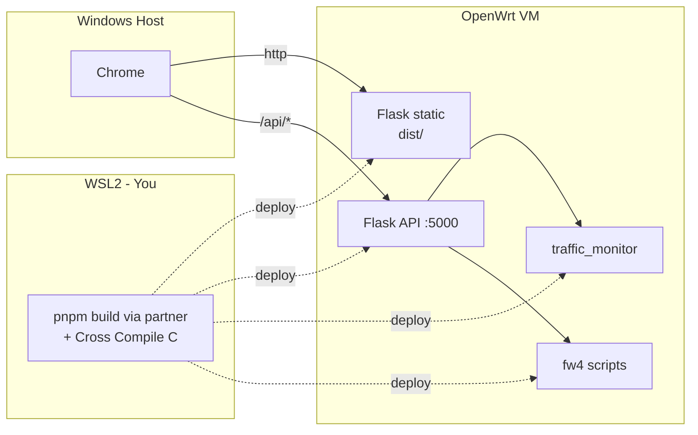

## 一、角色与分工原则

| 维度 | 你（WSL2 Ubuntu 22.04） | 同伴（Windows + VMware 17 + Node.js） |
|---|---|---|
| 主要职责 | C/libpcap 流量监控、Flask 后端、Shell 脚本、Git/架构 | **Vue 3 前端**、OpenWrt VM 部署、真实环境联调、演示视频 |
| 开发位置 | WSL2 内编码与交叉编译 | Windows 宿主机跑 Vite Dev Server；VMware 内跑 OpenWrt |
| 交付物 | `traffic-monitor/`、`backend/`、`firewall-scripts/` | `frontend/`（Vue 3 + Vite + ECharts + UI 库）、演示视频、运行截图 |
| 不能独立做的事 | 在 OpenWrt 上跑程序、用 fw4/uci 真改路由器、Vue 工程化（让同伴做） | C/libpcap 抓包、Flask 后端、shell 脚本（让你做） |

**核心原则**：API 契约先行 → 前后端并行开发 → 各自用 Mock 跑通 → 在 OpenWrt VM 集成联调。这是典型的"接口驱动开发（Contract-First）"。

## 二、WSL2 上你能做的全部 coding 任务

- C 程序：libpcap 抓包、统计、JSON 输出（在 WSL2 的 `eth0` 上先跑通逻辑）
- 交叉编译：用 OpenWrt SDK（`x86_64-openwrt-linux-musl`）把 C 程序编成 OpenWrt 能跑的二进制
- Python Flask 后端：API 设计、白名单校验、子进程调用、CORS 配置（同伴 Vite Dev Server 在 `:5173`，Flask 在 `:5000`，跨域要放行 `http://localhost:5173`）
- Shell 脚本：防火墙的 `fw4/nft` 命令封装（**fw4 行为只能在 OpenWrt 上验证**，WSL2 只能写不能验证）
- Mock 服务：给同伴的 Vue 前端先提供假数据接口（用 Flask 或更轻的 `json-server`）
- 单元测试、文档、Git 维护、CI（可选）

**WSL2 做不了**：在 OpenWrt 上启动程序、验证 fw4 规则真实生效、抓 OpenWrt 网卡的真实流量、录演示视频、跑 Vue 前端的可视化调试。这些必须同伴在 Windows + VMware 里完成。

## 二之二、同伴在 Windows 上能做的 coding 任务

- Vue 3 + Vite + TypeScript（推荐）/ JavaScript 工程
- UI 框架：**Element Plus** 或 **Naive UI**（防火墙表单/表格组件齐全）
- 图表：`echarts` + `vue-echarts`（流量监控折线图）
- 状态管理：Pinia（如果觉得简单可不用，直接 `ref` + `composable` 也够）
- 路由：Vue Router，两个页面（`/traffic` 流量监控、`/firewall` 防火墙）
- HTTP：axios 或原生 `fetch`，统一封装 `src/api/`
- 构建产物：`pnpm build` → `dist/`，纯静态文件，能被任意静态服务器（Flask static、uhttpd、Nginx）托管

## 三、Git 够不够？答案：**主体够，但要补两样**

Git 适合：源码、脚本、文档、配置模板。**OpenWrt 镜像、pcap 采样、演示视频、AI 对话截图原图** 不应入库。

需要额外的两样：
- **共享云盘**（阿里云盘 / 百度网盘 / OneDrive 任选一个）：放 OpenWrt 24.10.0 的 `img` / 转换后的 `vmdk`、采样 `.pcap`、最终演示视频
- **实时联调通道**：腾讯会议屏幕共享 / VSCode Live Share，用于你写完代码、同伴在 OpenWrt 跑、双方一起 debug

## 四、仓库结构（你负责初始化）

```text
ComputerNetworkExp/
├── README.md                 # 项目总览、分工、构建步骤
├── .gitignore                # 忽略 build/、*.o、__pycache__、*.pcap、*.vmdk、*.img
├── docs/
│   ├── 实验指导书.docx        # 已存在
│   ├── 实验报告.docx          # 最终交付
│   └── ai-usage.md           # AI 使用记录（重要，漏写 0 分）
├── traffic-monitor/          # 任务 2：C 程序
│   ├── src/{main.c,capture.c,stats.c,output.c}
│   ├── include/*.h
│   ├── Makefile              # host 本地编译
│   └── Makefile.openwrt      # OpenWrt SDK 交叉编译
├── firewall-scripts/         # 任务 3：shell
│   ├── add_rule.sh
│   ├── del_rule.sh
│   ├── list_rules.sh
│   └── clear_rules.sh
├── backend/                  # Flask
│   ├── app.py
│   ├── api/{traffic.py,firewall.py}
│   └── requirements.txt
├── frontend/                 # Vue 3 + Vite（同伴负责）
│   ├── package.json
│   ├── pnpm-lock.yaml
│   ├── vite.config.ts        # 含 server.proxy 代理 /api 到 Flask
│   ├── tsconfig.json
│   ├── index.html
│   ├── src/
│   │   ├── main.ts
│   │   ├── App.vue
│   │   ├── router/index.ts
│   │   ├── api/{traffic.ts,firewall.ts}
│   │   ├── views/{TrafficView.vue,FirewallView.vue}
│   │   ├── components/{TrafficChart.vue,FirewallForm.vue,RuleTable.vue}
│   │   └── types/{traffic.ts,firewall.ts}
│   └── README.md             # 启动方式：pnpm i && pnpm dev
├── scripts/
│   ├── deploy_to_openwrt.sh  # scp/samba 部署
│   └── package_submission.sh # 打包源码 zip
└── test/
    └── traffic_generator.py  # 造流量
```

## 五、协作数据流图

### 开发期数据流（前后端并行）

```mermaid
flowchart LR
    subgraph WSL [WSL2 - You]
        Dev[C + Flask + Shell]
        Xc[Cross Compile]
        Flask[Flask :5000<br/>with CORS]
    end
    subgraph WinHost [Windows Host - Partner]
        Vite[Vite Dev :5173]
        Browser[Browser :5173]
    end
    subgraph GitRepo [Git]
        Repo[Source]
    end
    subgraph VMware [VMware OpenWrt VM]
        OW[OpenWrt]
        Cprog[traffic_monitor]
    end
    Dev --> Repo
    Repo --> Vite
    Browser --> Vite
    Vite -->|"proxy /api"| Flask
    Flask -.read /tmp/traffic.json.-> Cprog
    Xc -.scp.-> OW
    OW --> Cprog
```

### 生产/演示期数据流（全栈跑在 OpenWrt 上）



## 六、四阶段排期（约 12 个工作日，按你们节奏调）

### Phase 0 启动（Day 1，并行）
- 你：WSL2 建仓库骨架，写 `.gitignore`、`README.md`、`docs/api.md`（API 契约草稿）、约定 commit 规范
- 同伴：装 VMware 17、下载 OpenWrt 24.10.0 `img`、StarWind V2V 转 `vmdk`、`vmdk` 上传云盘；**同步装 Node.js LTS（20.x）+ pnpm**（`npm i -g pnpm`）

### Phase 1 环境就绪 + API 契约（Day 2-3，并行）
- 你：
  - `sudo apt install build-essential libpcap-dev python3 python3-pip python3-venv`
  - 下载 OpenWrt SDK 24.10.0 x86_64 musl 版，跑 hello world 交叉编译验证
  - 起 Flask 骨架：`flask-cors` 放行 `http://localhost:5173`，`/api/health` 跑通
  - 编写 **Mock 数据**：`backend/mock/traffic.json`、`backend/mock/firewall_rules.json`，让 `/api/*` 在 C 程序还没好之前就能返假数据
- 同伴：
  - 启动 OpenWrt VM，按指导书 4.1 节配 `/etc/config/network`，`/etc/init.d/network restart`
  - `opkg update && opkg install luci-app-samba4`，配 `/mnt/p0`，`chmod -R 777 /mnt/p0`，Windows `\\OpenWrt-IP` 验证 SMB
  - 把 OpenWrt 的 IP、网卡名写入 `docs/env.md`
  - **初始化 Vue 工程**：`pnpm create vite frontend --template vue-ts`，装 `vue-router`、`pinia`（可选）、`axios`、`element-plus`（或 `naive-ui`）、`echarts`、`vue-echarts`
  - 配 `vite.config.ts`：
    ```ts
    server: {
      proxy: {
        '/api': { target: 'http://<你的WSL2 IP 或 OpenWrt VM IP>:5000', changeOrigin: true }
      }
    }
    ```
  - 启动 `pnpm dev`，能正常打开 `http://localhost:5173` 并代理到 Flask `/api/health`
- 两人：**共同敲定 API 契约**，写入 `docs/api.md`。例如：
  ```
  GET  /api/traffic           -> { ts, items: [{srcIp, dstIp, srcPort, dstPort, proto, rxBytes, txBytes, peak, avg2s, avg10s, avg40s}] }
  GET  /api/firewall/rules    -> { rules: [{id, proto, src, dst, port, action}] }
  POST /api/firewall/rules    body {proto, src, dst, port, action} -> { ok, stdout, stderr, code }
  DELETE /api/firewall/rules/:id -> { ok, stdout, stderr, code }
  POST /api/firewall/clear    -> { ok, stdout, stderr, code }
  ```

### Phase 2 流量监控（Day 4-7）
- 你（主力）：
  - `traffic-monitor/`：libpcap 抓包 → 按 IP 五元组哈希累加 → 滑动窗口（2s/10s/40s）→ 周期性 dump `/tmp/traffic.json`
  - 关键 API：`pcap_open_live` / `pcap_compile` / `pcap_setfilter` / `pcap_loop`；用 `pthread` 把"抓包"与"统计上报"解耦
  - 命令行版本先跑通
  - `backend/api/traffic.py`：`GET /api/traffic` 读 `/tmp/traffic.json` 返 JSON，**保持 Mock 接口同构**
- 同伴（前端 + 联调）：
  - 在 Windows 上开发 `views/TrafficView.vue`：
    - 用 `vue-echarts` 画实时折线图（按时间 X 轴、速率 Y 轴）
    - 用 Element Plus `<el-table>` 展示累计/峰值/2s/10s/40s 均值
    - `setInterval` 每 1-2 秒拉一次 `/api/traffic`
  - 先对你提供的 Mock 跑通页面，再切真实接口
  - 把你交叉编译的二进制通过 Samba 拉进 OpenWrt 跑、造流量、截图

### Phase 3 防火墙配置（Day 8-10）
- 你：
  - `firewall-scripts/`：OpenWrt 的 `fw4`（底层 nftables）实现 增/删/查/清。脚本只接 argv，**用户输入禁止 shell 拼接**
  - `backend/api/firewall.py`：
    - JSON 入参 `{proto, src, dst, port, action}`
    - 严格白名单：`proto ∈ {tcp,udp,icmp}`、`action ∈ {accept,reject,drop}`、IP 走 `ipaddress.ip_address()`、端口 `1-65535`
    - `subprocess.run([...], shell=False, check=False, capture_output=True, timeout=5)`
- 同伴：
  - `views/FirewallView.vue`：用 Element Plus `<el-form>` 做规则录入、`<el-table>` 展示规则列表、专门一块 `<el-card>` 折叠展示 `stdout/stderr/exit_code`
  - `App.vue` 用 `<el-menu>` 或 `<el-tabs>` 做两个路由切换
  - 在 OpenWrt 上 `chmod +x` 脚本、实测 fw4、记录**规则添加前后访问验证**对比（指导书 3.3 节硬要求）

### Phase 4 集成、报告、视频（Day 11-12）
- 同伴：
  - `pnpm build` 输出 `frontend/dist/`，通过 Samba 推到 OpenWrt 的某目录（例如 `/www/app/`），由 Flask 或 uhttpd 托管
  - 录演示视频 ≤ 5 分钟：OpenWrt 启动 → 打开 Web → 流量监控造流量看曲线 → 切防火墙 → 加规则 → 访问验证 → 删规则 → 恢复访问
  - 报告里所有运行截图在 OpenWrt VM 真实环境出图
- 你：
  - 整理代码、补注释、每个目录 README
  - 写实验报告（理论 + 实现 + 截图）
  - **`docs/ai-usage.md`** 完整记录 AI 对话（提示词、输出节选、你的评价与修改），漏写 0 分
- 两人：
  - 跑 `scripts/package_submission.sh`：源码 zip 时 **要包含 `frontend/dist/` 与 `frontend/src/`、但排除 `node_modules/`**
  - 命名 `张三+李四_代码.zip`、`张三+李四_演示.mp4`、`张三+李四_报告.docx`，提交

## 七、协作规范（避免踩坑）

1. **API 契约先行**：`docs/api.md` 是合同。任何一方要改字段，先发 PR 改文档，对方同意再改代码。
2. **CORS / 代理二选一**：开发期同伴用 Vite proxy（推荐，零 CORS 烦恼）；如果坚持直连 Flask，后端必须开 `flask-cors` 放行 `http://localhost:5173`。
3. **Mock 数据是协作粘合剂**：你写好 Mock JSON 后，同伴可独立把整个 Vue 页面跑通。后端真实接口出来后只切一下 base URL，不改前端。
4. **行尾符**：你在 WSL2 写的 `.sh` 必须是 LF。`.gitattributes` 加 `*.sh text eol=lf`、`*.vue text eol=lf`、`*.ts text eol=lf`，否则跨平台炸。
5. **网卡名/路径参数化**：所有程序通过 `-i` 参数或环境变量读网卡与 JSON 路径，不要硬编码 `eth0` / `/mnt/p0`。
6. **不入库清单**（`.gitignore`）：`build/ *.o *.exe __pycache__/ .venv/ *.pcap *.log node_modules/ frontend/dist/ *.iso *.img *.vmdk *.mp4 .DS_Store .vscode/ .idea/`。
7. **Git 流程**：保护 `main`，开 `feat/traffic-c`、`feat/fw-script`、`feat/web-traffic`、`feat/web-firewall` 分支；2 人也走 PR；commit 用 Conventional Commits。
8. **大文件去云盘**：OpenWrt vmdk、pcap、视频、报告原稿截图原图、`node_modules` 缓存全走云盘，Git 只放小文件。
9. **联调机制**：每天 30-60 分钟腾讯会议 + VSCode Live Share。前期高频对齐 API，中期联调，后期一起出报告/视频。
10. **包管理器锁定**：约定用 `pnpm`（或都用 `npm`），不要混。否则 `pnpm-lock.yaml` 和 `package-lock.json` 在 Git 里互相冲突。

## 八、关键交付物自检清单

- [ ] OpenWrt VM 可正常联网（同伴）
- [ ] 同伴 Windows 上 `pnpm dev` 能起前端并代理到 Flask（同伴）
- [ ] `docs/api.md` API 契约写完且双方签字认可（两人）
- [ ] Flask Mock 接口能返合规 JSON（你）
- [ ] 交叉编译产物在 OpenWrt 上能跑且无动态库报错（两人）
- [ ] 流量监控 CLI 版输出正确（你）
- [ ] 流量监控 Vue 页面看到实时曲线（同伴）
- [ ] 防火墙 4 个操作都通过 Web 完成（同伴）
- [ ] 规则生效前后访问对比可复现（同伴）
- [ ] 后端拒绝非法参数（你写单测）
- [ ] `pnpm build` 出的 `dist/` 在 OpenWrt 上托管能跑（两人）
- [ ] 演示视频 ≤ 5 分钟（同伴）
- [ ] AI 使用说明完整（你）
- [ ] 源码 zip + 报告 docx + 视频 mp4，命名规范（两人）

## 九、Vue 切换带来的额外考量

- **bundle 体积**：Vue 3 + Element Plus + ECharts 全量打包约 1-2 MB，OpenWrt `/www` 完全装得下，但建议开 ECharts 的按需引入（只引 `LineChart` + `CanvasRenderer`）。
- **路由模式**：用 `createWebHashHistory`（hash 模式），可以直接由静态文件服务托管而不需要 SPA fallback 配置；`createWebHistory` 需要后端配合 fallback 到 `index.html`，OpenWrt 上 uhttpd 配置稍麻烦。
- **HTTPS**：本实验不强求 HTTPS，HTTP 即可。如果未来上真机要 HTTPS，自签证书 + Vite `server.https = true`。
- **生产构建注入接口地址**：`vite.config.ts` 用 `import.meta.env.VITE_API_BASE`，开发时空字符串走代理，生产时设 `''`（同源访问）或具体 OpenWrt IP。
- **同伴 Vue 不熟也能兜底**：UI 框架自带的组件能覆盖 95% 工作量，他主要写表单 schema 和图表 option，不需要写复杂业务组件。