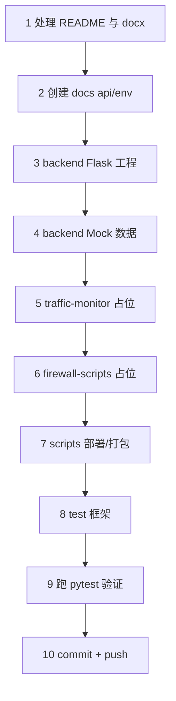

## 一、Build 目标

完成 [docs/plans/role-A-wsl2-backend.md](docs/plans/role-A-wsl2-backend.md) 的 **Phase 0 收尾 + Phase 1 全部**。一次执行后达到：

- 团队 clone 仓库后能看到完整目录结构和合理的 README
- 角色 B（Vue 同伴）能立刻 `pnpm dev` 并通过 Vite proxy 拉到 Flask Mock 接口的真实 JSON 数据，开始写页面
- 角色 C（VMware 同伴）能根据 docs/env.md 模板开始填环境信息
- 你自己后续 `cd backend && flask run` 就能启服务，所有路由有 Mock 兜底
- C 程序、shell 脚本、测试目录都有占位文件，Phase 2/3 直接往里填实现

**不在本 Build 范围**：
- C 程序的实际 libpcap 实现（Phase 2）
- 防火墙 shell 脚本的 fw4 真实命令（Phase 3）
- OpenWrt SDK 下载与 hello world 交叉编译（手动操作，体积大不适合一键 Build）
- README.md 被你本地清空那份 —— 本 Build 会直接覆盖写新内容

## 二、执行步骤

## 三、具体文件清单

### Step 1: 根目录

- [README.md](README.md)：覆盖被清空的版本，写项目简介、目录树、构建步骤、贡献规范、协作链接（指向 `docs/plans/`）
- 不动 `计算机网络系统-...docx`（让你自己决定是否入库）

### Step 2: 文档

- [docs/api.md](docs/api.md) **API 契约 v1**：
  - 5 个接口的完整请求/响应 schema
  - traffic item 字段对照表（含单位、范围、示例）
  - 错误码约定（200 + `{ok:false}` 还是 4xx + body，按总计划已定的方案做）
  - 版本号 + 变更记录小节
- [docs/env.md](docs/env.md) **环境信息模板**：
  - OpenWrt VM IP、网卡名、Samba 路径、SSH 信息（角色 C 填空）
  - WSL2 IP 占位（你自己跑 `ip addr` 填）
  - 端口约定（Flask 5000、Vite 5173）

### Step 3: Flask 后端工程

- [backend/app.py](backend/app.py)：
  - 创建 Flask app，启用 `flask-cors` 放行 `http://localhost:5173`
  - 注册两个蓝图：`api.traffic`、`api.firewall`
  - `/api/health` 返回 `{ok: True, ts: ...}`
  - `if __name__ == "__main__"` 默认 `host="0.0.0.0", port=5000`
- [backend/config.py](backend/config.py)：从环境变量读 `TRAFFIC_JSON_PATH`（默认 `/tmp/traffic.json`）、`FIREWALL_SCRIPTS_DIR`（默认 `/usr/local/bin`）、`MOCK_MODE`（默认 `true`，部署时设 `false`）
- [backend/api/__init__.py](backend/api/__init__.py)：导出两个蓝图
- [backend/api/traffic.py](backend/api/traffic.py)：
  - `GET /api/traffic`：先读 `TRAFFIC_JSON_PATH`，文件不存在或 `MOCK_MODE=true` 时返 mock 数据
- [backend/api/firewall.py](backend/api/firewall.py)：
  - `GET /api/firewall/rules`：返 mock 列表
  - `POST /api/firewall/rules`：白名单校验通过则在 mock 内存 list 加一条，返 `{ok, stdout, stderr, code, ruleId}`；校验失败返 4xx
  - `DELETE /api/firewall/rules/<id>`：mock 删除
  - `POST /api/firewall/clear`：mock 清空
  - 校验逻辑提到 `backend/api/_validators.py`，Phase 3 会被真实 subprocess 调用复用
- [backend/api/_validators.py](backend/api/_validators.py)：`validate_firewall_payload(d)`，覆盖 proto/action/IP/port 白名单
- [backend/mock/traffic.json](backend/mock/traffic.json)：3-5 条 mock 条目，字段与 docs/api.md 一致
- [backend/mock/firewall_rules.json](backend/mock/firewall_rules.json)：2 条 mock 规则
- [backend/requirements.txt](backend/requirements.txt)：`flask>=3.0`、`flask-cors`、`pytest`
- [backend/README.md](backend/README.md)：本地启动命令、Mock 模式说明

### Step 4: 占位工程

- [traffic-monitor/](traffic-monitor/)：
  - `src/.gitkeep`、`include/.gitkeep`
  - `Makefile` 写好基本结构（target: `bin/traffic_monitor`，CFLAGS 含 `-Wall -O2 -pthread`，`pkg-config --libs libpcap`），但 src/ 为空，注释 `# Phase 2 fill in`
  - `Makefile.openwrt` 注释模板，说明需要 `STAGING_DIR`、`TOOLCHAIN_DIR` 等 SDK 环境变量
  - `README.md` 说明这里 Phase 2 做什么、CLI 参数约定
- [firewall-scripts/](firewall-scripts/)：
  - `add_rule.sh`、`del_rule.sh`、`list_rules.sh`、`clear_rules.sh` 全部只写 shebang `#!/bin/sh`、`set -e` 和 `echo "TODO: Phase 3"` + `exit 0`，保证语法正确
  - `README.md` 说明参数规范（位置参数、白名单、禁用 shell 拼接）

### Step 5: 工具与测试

- [scripts/deploy_to_openwrt.sh](scripts/deploy_to_openwrt.sh)：scp 模板（用环境变量 `OPENWRT_HOST`，注释提示用 SSH 而非 password）
- [scripts/package_submission.sh](scripts/package_submission.sh)：tar/zip 打包源码骨架，排除 `node_modules`、`__pycache__`、`build/`、`.venv`
- [test/test_health.py](test/test_health.py)：pytest 验 `/api/health`
- [test/test_traffic_api.py](test/test_traffic_api.py)：验 `/api/traffic` 在 mock 模式返合规 JSON
- [test/test_firewall_api.py](test/test_firewall_api.py)：
  - 正常加规则成功
  - 非法 proto 被拒
  - 非法 action 被拒
  - 非法 IP 被拒
  - 非法 port 被拒
  - **命令注入字符串（`; rm -rf /`、` && curl`）被拒**
- [test/traffic_generator.py](test/traffic_generator.py)：用 `socket` 或简单 `requests` 造测试流量的占位

### Step 6: 验证与提交

- 在 WSL2 上跑：
  - `python -m venv .venv && source .venv/bin/activate`
  - `pip install -r backend/requirements.txt`
  - `pytest test/ -v` 应全绿
  - `cd backend && python app.py` 然后另一终端 `curl http://localhost:5000/api/health` 返 200
  - `curl http://localhost:5000/api/traffic` 返 mock JSON
- commit message 走 Conventional Commits：
  - `feat(backend): scaffold flask app with mock api endpoints`
  - `docs: add api contract v1 and env template`
  - `chore: scaffold placeholder dirs for c program and firewall scripts`
  - 这里我会用一个 squash 提交 `feat: scaffold phase 1 with flask mock backend and api contract`，把 docs + backend + 占位 + test 一起提
- push 到 `origin/main`

## 四、关键技术决策

| 项 | 决策 | 理由 |
|---|---|---|
| Flask CORS 范围 | 仅放行 `http://localhost:5173` 与 `http://127.0.0.1:5173` | 开发期前端来源固定；生产期同源部署不需要 |
| Mock 与真实切换 | 通过环境变量 `MOCK_MODE=true/false` 控制 | 不改代码、不重构，部署期一条命令切换 |
| API 错误响应 | 4xx 状态码 + `{ok: false, message: "..."}` body | 标准、前端 axios 拦截器好处理 |
| 蓝图划分 | `/api/traffic` 与 `/api/firewall/*` 各一个蓝图 | 后续 Phase 3 firewall 实现替换 mock 时不动 traffic |
| 防注入校验位置 | `_validators.py` 模块，被 mock 与真实分支同样调用 | Phase 3 切到真实 subprocess 时校验逻辑零迁移 |
| 测试驱动 | Phase 1 就把 5 个 firewall 安全测试写好 | Phase 3 实现真实命令时只用让测试继续通过即可，安全不留死角 |
| shell 占位 | shebang + `echo TODO + exit 0` | 保证 `chmod +x` 后能跑、`sh -n` 语法检查通过，不会因为空文件 lint 报错 |

## 五、风险与回滚

- 风险 1：`flask-cors` 在不同版本 API 不一致 → 用 `from flask_cors import CORS` 与 `CORS(app, origins=[...])` 标准写法，requirements 锁版本 `flask-cors>=4.0`
- 风险 2：`MOCK_MODE` 写错导致部署时仍返 mock → 在 `/api/health` 返回里同时返回 `mock_mode` 标记，便于排查
- 风险 3：测试用例引入 `test/` 目录但 import 路径找不到 backend → 加 `conftest.py` 或在 pytest 配置 `pythonpath = backend`
- 回滚：所有改动 squash 在一个 commit，万一有问题 `git revert HEAD` 即可