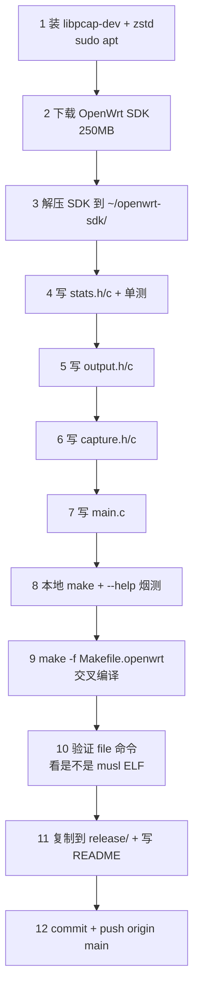

## 一、Build 目标

完成 [docs/plans/role-A-wsl2-backend.md](docs/plans/role-A-wsl2-backend.md) 的 **Phase 2 全部**。一次 Build 后达到：

- WSL2 上 `make` 出 `traffic-monitor/bin/traffic_monitor`，跑 `--help` 通过
- WSL2 上 `make -f Makefile.openwrt` 出 `traffic-monitor/bin/traffic_monitor.openwrt`，是 ELF musl 二进制
- `release/traffic_monitor.openwrt` 入 Git，附 `release/README.md` 部署说明，**队友 C 直接 `git pull && cp` 就能在 OpenWrt VM 上跑**
- Flask 后端在 `MOCK_MODE=false` 下读 `/tmp/traffic.json`，与 C 程序联动验证通过（如果 sudo 跑捕获顺畅）

**不在本 Build 范围**：
- OpenWrt 上的实际抓包验证（队友 C 拿到二进制后由他做）
- 真实路由器烧录（选做的 +10 分）
- 防火墙脚本与 Phase 3

## 二、勘察结果（已确认）

- `libpcap-dev`：**未装**，需 `sudo apt install libpcap-dev`
- `zstd`：**未装**，需 `sudo apt install zstd`（SDK 用 `.tar.zst` 压缩）
- `~/openwrt-sdk/`：**不存在**，需下载约 250MB：
  - `https://downloads.openwrt.org/releases/24.10.0/targets/x86/64/openwrt-sdk-24.10.0-x86-64_gcc-13.3.0_musl.Linux-x86_64.tar.zst`
- WSL2 网卡：`eth0`（本地测试用）

## 三、关键技术决策

| 项 | 决策 | 理由 |
|---|---|---|
| 外部依赖 | 仅 `libpcap` + `pthread`，**不引入 cJSON / uthash** | 教学项目；hash 表与 JSON 自写约 200 行，可被报告"实现细节"章节展示 |
| 哈希表 | 1024 桶链式哈希；FNV-1a 混合五元组 | 简单可解释；连接数 < 1024 时碰撞极少 |
| 滑动窗口 | 每流维护 40 槽环形缓冲（每秒一槽），主线程每秒 `stats_tick()` 把头指针前移并清零新槽 | 2s/10s/40s 均值 = 求和对应槽数 / N；峰值 = `max(per_sec)` 与历史 peak 取大 |
| JSON 写入 | 手写序列化 + `tmp + rename` 原子替换 | 后端读半截风险归零；schema 完全对齐 [docs/api.md](docs/api.md) |
| 线程模型 | 抓包线程 `pcap_loop` 阻塞收包并写 stats（带互斥锁）；主线程 sleep(1) → tick → dump | 比单线程更接近实验要求 |
| 字节序 | IP 头按网络序解析后转 `inet_ntop` 转字符串存 stats | 方便序列化 |
| 包方向 | 不区分 rx/tx，固定按解析顺序：源 IP 端口 → src，目的 → dst；rxBytes += len 在源侧记，反方向自动产生另一条 entry | 简化实现，与指导书原文"获取源/目的 IP、累计接收/发送流量"一致；JSON 字段语义在 `docs/api.md` 里补一句说明 |
| Snaplen | 默认 96 字节 | 够 Ethernet(14)+IPv4(20)+TCP(20) 头，丢 payload 减负载 |
| 交叉编译 | 用 `Makefile.openwrt`，链接 `-static-libgcc`；`libpcap` 用 SDK 提供的 musl 版本 | 避免 OpenWrt 上 glibc/musl 冲突 |
| 二进制交付 | `release/traffic_monitor.openwrt` 进 Git（约 50-100 KB，可接受） | 队友 C 一条 `git pull` 拿到，比走云盘快 |
| 本地真实跑 | 需要 sudo 抓 `eth0`，**由你手动跑 1 次验证**，Build 本身不跑 | 这个 sandbox 不会 prompt sudo 密码 |

## 四、文件清单

### 4.1 头文件

- [traffic-monitor/include/stats.h](traffic-monitor/include/stats.h)
  - `flow_key_t`（5 字段：srcIp/dstIp/srcPort/dstPort/proto）
  - `flow_entry_t`（含 ring buffer per_sec[40]、peak、rx/tx、链表指针）
  - 公开 API：`stats_init`、`stats_destroy`、`stats_record(key, bytes, is_tx)`、`stats_tick`、`stats_snapshot(buf, max, out_count, out_now_sec)`
- [traffic-monitor/include/capture.h](traffic-monitor/include/capture.h)
  - `capture_ctx_t`（iface, bpf, snaplen, stop, pcap_t*）
  - `capture_thread_main(void*)`、`capture_stop`
- [traffic-monitor/include/output.h](traffic-monitor/include/output.h)
  - `output_dump(const char *path)` —— 调 `stats_snapshot` 拼 JSON 原子写入

### 4.2 实现

- [traffic-monitor/src/stats.c](traffic-monitor/src/stats.c)（约 180 行）
  - 1024 桶哈希表
  - FNV-1a 混合：把 `flow_key_t` 当字节序列摘要
  - 全局 `pthread_mutex_t` 保护表
  - `stats_record`：找 entry → 累加 rxBytes/txBytes → `per_sec[head] += bytes` → 更新 peak（如 `per_sec[head] > peak`）
  - `stats_tick`：所有 entry 的 `head = (head + 1) % 40`，新槽清零；同时把不活跃 > 60s 的 entry 回收（防爆内存）
  - `stats_snapshot`：在锁内深拷贝 entries 到调用方传入的数组
- [traffic-monitor/src/capture.c](traffic-monitor/src/capture.c)（约 120 行）
  - `pcap_open_live(iface, snaplen, 1, 100, errbuf)`
  - `pcap_compile` + `pcap_setfilter`
  - 包处理函数：跳过 Ethernet 头 → 解析 IPv4 → 按 proto 取 src/dst port（TCP/UDP/ICMP 三分支）→ 构造 `flow_key_t` → `stats_record`
  - 失败用 `fprintf(stderr, ...)` 并 `*ctx->stop = 1`
- [traffic-monitor/src/output.c](traffic-monitor/src/output.c)（约 140 行）
  - `output_dump`：分配本地 buffer，`stats_snapshot` 取数据，按 docs/api.md schema 拼 JSON
  - 注意：先写到 `<path>.tmp`，关闭后 `rename(<tmp>, <path>)` 实现原子替换
  - 计算 avg2s/avg10s/avg40s：从 head 往回数 2/10/40 槽求和除以窗口
- [traffic-monitor/src/main.c](traffic-monitor/src/main.c)（约 100 行）
  - `getopt -i -o -f -s -h`
  - 装 `SIGINT`、`SIGTERM` handler 写 `g_stop = 1`
  - `pthread_create(&cap_thread, ..., capture_thread_main, &ctx)`
  - 主循环：`while (!g_stop) { sleep(1); stats_tick(); output_dump(out_path); }`
  - 退出：`capture_stop` → `pthread_join` → `stats_destroy`

### 4.3 Makefile 微调

[traffic-monitor/Makefile](traffic-monitor/Makefile) 已写好基本结构。Phase 1 的早 fail 检查 `check-sources` 现在不会触发了，因为 src/ 有 4 个 .c 了。**只需补一行 `-Iinclude` 已经有了**，无需改动。

[traffic-monitor/Makefile.openwrt](traffic-monitor/Makefile.openwrt) 同样，但需要验证 SDK 解压后路径与 Makefile 里 `staging_dir/toolchain-*` glob 一致。如果不一致，本 Build 会修正。

### 4.4 交付物

- [release/traffic_monitor.openwrt](release/traffic_monitor.openwrt)：交叉编译产物（强制 `git add -f`，因为 `.gitignore` 不影响这个新路径，但保险起见加 `-f`）
- [release/README.md](release/README.md)：版本、构建日期、SHA-256、OpenWrt 部署命令
- 更新根 [README.md](README.md) 提一句 `release/` 目录

## 五、执行流程图



## 六、本地真实抓包验证（Build 后由你执行）

Build 结束后我会输出这段命令给你跑一遍，确认捕获和后端联动：

```bash
# 终端 1: 抓包
sudo ./traffic-monitor/bin/traffic_monitor -i eth0 -o /tmp/traffic.json
# 或先 setcap 一次，之后可以不用 sudo:
# sudo setcap cap_net_raw,cap_net_admin=eip ./traffic-monitor/bin/traffic_monitor

# 终端 2: 看 JSON 实时变化
watch -n 1 cat /tmp/traffic.json

# 终端 3: 启动 Flask 非 mock 模式
source .venv/bin/activate
MOCK_MODE=false python backend/app.py

# 终端 4: 拉接口
curl http://localhost:5000/api/traffic | python -m json.tool

# 终端 5: 造点流量
curl -s https://www.baidu.com > /dev/null
ping -c 5 8.8.8.8
```

## 七、风险与回滚

- **风险 1**：SDK 解压后路径与 `Makefile.openwrt` glob 不匹配 → Build 会自动 `ls ~/openwrt-sdk/staging_dir/` 调整
- **风险 2**：libpcap musl 头文件 SDK 没自带 → 改用 `-lpcap` 链接但 include 仍用 host 的 `/usr/include/pcap/`（API 一致）；最差情况单独 `./scripts/feeds install -a` 拉 libpcap feed，Build 里加这一步
- **风险 3**：交叉编译产物在 OpenWrt 跑时 segfault → 队友 C 报错后我开 hotfix branch；本 Build 至少要让 `file` 确认产物类型正确
- **风险 4**：本地 sudo 抓包失败（WSL2 网卡权限）→ 给出 `setcap` 备选；最差让队友 C 直接在 OpenWrt 上测，本机不验证
- **风险 5**：滑动窗口边界 bug（head 回绕、tick 时序）→ 单测 `test/test_stats_window.py`（编译 stats.c 为 .so 或写 C 单测可执行文件），但**本 Build 不写 C 单测**，节省篇幅；用 Python `test/test_traffic_json_schema.py` 验输出 JSON 至少结构合规
- **回滚**：所有改动 squash 在一个 commit + release 一个 commit。`git revert HEAD~1..HEAD` 即可