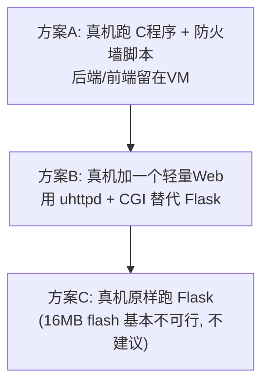
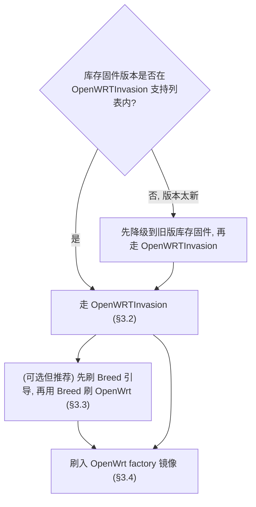

# 真机部署教程：小米路由器 R4CM 烧录 OpenWrt 并部署实验成果

> 对应实验指导书"将实验成果部署烧录到运行 OpenWrt 的真实路由器上"（+10 分选做）。
>
> 目标设备：**小米路由器 4C（型号 R4CM）**。
>
> **本任务由 Role B 全程操作**：路由器在 B 手上，B 也有 WSL2 环境（但还没装过任何 OpenWrt 相关工具）。因此本文档从"在 B 的 WSL2 上从零搭建交叉编译环境"开始，一直到刷机、部署、真机运行，全部由 B 一个人能独立完成。
>
> ⚠️ 刷机有变砖风险，B 操作前请把本文档（尤其 §0、§2、§6）整篇读完再动手。

---

## ⚠️ 0. 先读这一节：R4CM 是一台"极限低配"设备

这一步决定了后面**所有**工作，请务必先理解。R4CM 和你们现在跑得很顺的 x86_64 VM **是两个世界**：


| 维度             | 你们的 VM（开发/演示环境） | 小米 R4CM（目标真机）                |
| -------------- | --------------- | ---------------------------- |
| CPU 架构         | x86_64          | **MIPS（mipsel，小端）**          |
| OpenWrt target | `x86/64`        | `**ramips/mt76x8`**          |
| SoC            | 虚拟 CPU          | MediaTek MT7628NN，单核 ~580MHz |
| 内存             | 512MB-1GB       | **64MB**                     |
| 闪存(flash)      | 数 GB 虚拟磁盘       | **16MB**（务必核实，见下）            |
| USB 口          | 有（虚拟）           | **无**                        |


由此引出 3 个硬约束：

1. **你们交叉编译好的 `release/traffic_monitor` 在 R4CM 上完全不能用**。它是 x86_64 musl 的 ELF，架构对不上。必须**重新为 `ramips/mt76x8` 交叉编译**（见 §4）。
2. **16MB flash + 64MB RAM 装不下 Python3 + Flask**。OpenWrt 基础系统本身就占掉一大半 flash，剩下空间塞不进 Python 解释器 + Flask + 依赖；64MB RAM 跑 Python 也非常吃力。而且 4C **没有 USB 口**，无法用 U 盘做 extroot 扩容。
3. 因此"完整三件套（C 程序 + Flask 后端 + Vue 前端）原样搬上真机"在 R4CM 上**不现实**。需要选一个降级但可行的方案（见 §1）。

> **必做的第一步：核实你的硬件。** 打开 OpenWrt 官方设备页搜索 "Xiaomi Mi Router 4C"，确认：
>
> - flash 容量（8MB 还是 16MB —— 8MB 的话连刷 24.10 都可能放不下，要用更老/精简的版本）
> - 是否在你的 OpenWrt 目标版本里有对应固件
> - 你手上**库存固件（stock firmware）版本号**（决定刷机方法，见 §3）
>
> 设备页地址形如 `https://openwrt.org/toc/start` → 搜 "4C"。刷机前把设备页从头到尾读一遍，比这份文档更权威。

---

## 1. 选择部署方案（先决定做到哪一步）

根据 §0 的约束，给出三个方案，按"投入/风险"从低到高排列。**强烈建议先做方案 A，行有余力再冲方案 B。**




### 方案 A（推荐，性价比最高）—— "核心成果上真机"

- **R4CM 上**：刷 OpenWrt + 跑你们的 C 流量监控程序（MIPS 版）+ 跑防火墙脚本（uci/fw4 原生）。
- **VM 或 PC 上**：继续跑 Flask 后端 + Vue 前端，后端通过 SSH/网络读取真机产生的数据。
- 满足指导书"把实验成果烧录到真实路由器"的核心诉求：**真机确实在抓真实流量、真机防火墙规则真实生效**，且有真机截图/演示。
- 报告里诚实说明：受 16MB flash 限制，Web 后端运行在配套主机上，路由器负责数据采集与防火墙执行。这是**完全合理且专业**的工程取舍。

### 方案 B（进阶）—— "真机自带极简 Web"

- 用 OpenWrt 自带的 `uhttpd`（本来就在系统里，不额外占 flash）托管一个静态页面 + 几个 shell/CGI 脚本，直接读 `/tmp/traffic.json`、调防火墙脚本。
- 不需要 Python。代价是要把 Vue 前端的逻辑改写成极简静态页（或只展示 JSON），工作量在 Role B。
- 适合想让"打开路由器 IP 就能看到 Web 界面"的演示效果。

### 方案 C（不建议）—— "硬塞 Flask"

- 16MB flash 几乎塞不下；即使用 tmpfs 临时装到内存，重启即丢、64MB RAM 也容易 OOM。**仅在你核实出设备是 32MB+ flash 的特殊批次时才考虑。**

> 本教程 §2-§6 覆盖**方案 A 的完整链路**，并在 §7 给出方案 B 的提示。

---

## 2. 准备工作（Role B 操作）

### 2.1 物料清单

- [ ] 小米 R4CM 一台、原装电源、一根网线（接 B 的电脑）
- [ ] B 的电脑：Windows + WSL2（已具备）；刷机/SSH 用 Windows 侧，编译用 WSL2 侧
- [ ] R4CM 的**库存固件版本号**：在小米 WiFi App 或路由器后台 `192.168.31.1` → 系统状态里查看并记下
- [ ] OpenWrt 对应版本的固件（**factory** 镜像，`ramips/mt76x8`，机型 `xiaomi_mi-router-4c`）
- [ ] OpenWrt **SDK**（`ramips/mt76x8`，版本号要和上面固件一致），用于交叉编译 C 程序（§4 会下载）
- [ ] 强烈建议：准备好 **TFTP 恢复**所需的工具和**库存固件备份**（变砖时救命，见 §6）

### 2.2 在 B 的 WSL2 上从零搭建交叉编译环境

> B 之前没装过 OpenWrt 工具链，这一节把 A 当初装过的东西一次性补齐。全部在 WSL2（Ubuntu）里执行。

```bash
# 1) 基础编译工具 + libpcap 交叉编译所需的 bison/flex + 解压 SDK 用的 zstd
sudo apt update
sudo apt install -y build-essential gcc make pkg-config bison flex \
    zstd git curl wget file

# 2) 克隆团队仓库（拿到 traffic-monitor 源码、firewall-scripts、Makefile）
cd ~
git clone git@github.com:Stevie-1/MyOpenWrt.git ComputerNetworkExp   # 或用 https 地址
cd ComputerNetworkExp
git pull origin main           # 确保是最新代码

# 3) 下载 libpcap 源码（§4.2 交叉编译要用，B 本地还没有）
mkdir -p ~/Downloads && cd ~/Downloads
wget https://www.tcpdump.org/release/libpcap-1.10.4.tar.gz
tar xzf libpcap-1.10.4.tar.gz
# 解压后得到 ~/Downloads/libpcap-1.10.4/
```

> 说明：这里**不需要**装 `libpcap-dev`（那是给 host 本机编译用的）。真机版要的是把 libpcap **静态交叉编译**进二进制，所以只下源码、用 SDK 工具链编（§4.2）。

### 2.3 风险须知（务必读）

- 刷机**有变砖风险**。R4CM 板子小、社区有成熟方法，但任何一步出错都可能导致设备无法启动。
- 刷机会**清空路由器**、**让保修失效**。
- 不要在赶 deadline 的当晚第一次刷。给自己留出试错和恢复的时间。

---

## 3. 刷入 OpenWrt（Role B 操作，最容易变砖的一步，慢慢来）

> 这一步主要在 **Windows 侧**操作（连小米后台、跑刷机工具、TFTP）。OpenWRTInvasion 是 Python 工具，B 可以在 WSL2 里跑、也可以在 Windows 里跑，但要能访问到路由器的 `192.168.31.1`（见 §5.1 关于 WSL2 网络的说明，必要时直接在 Windows 跑）。
>
> R4CM 的库存固件**锁定了 Web 升级**，不能像家用路由那样直接在后台上传固件包。需要先拿到设备的 root shell。主流方法是 **OpenWRTInvasion**（一个针对小米路由的远程命令执行工具）。**但它依赖特定库存固件版本**，新版库存固件已修补漏洞。

### 3.1 判断你的刷机路径




**关键：先去这两个地方对版本，不要凭本文档动手：**

- OpenWrt 官方 R4CM 设备页（Installation 章节，会写明当前可行的刷机方法）
- OpenWRTInvasion 项目主页（GitHub 上搜 `OpenWRTInvasion`）的"Supported devices / firmware versions"

### 3.2 用 OpenWRTInvasion 拿 root（思路，细节以项目 README 为准）

大致流程（**具体命令以项目 README 为准，版本不同参数会变**）：

1. 把路由器恢复出厂、用网线连电脑，电脑设静态 IP 同网段（如 `192.168.31.100`）。
2. 在小米后台登录，从浏览器地址栏拿到 `stok=` 这串登录令牌。
3. 运行 OpenWRTInvasion 脚本，填入路由器 IP 和 `stok`，它会利用漏洞开启 **telnet + ftp + 一个 root shell**。
4. 通过 ftp 把 OpenWrt 的 **factory 镜像**传到路由器 `/tmp/`。

### 3.3 （推荐）先装 Breed 不死引导

Breed 是第三方 bootloader，提供一个**网页刷机界面**和 **TFTP/网页恢复**能力，能把"变砖"风险大幅降低。装了 Breed 后，以后刷机/救砖都在 Breed 网页里点几下即可。

- 在上一步的 root shell 里，用 `mtd write` 把 breed 写入 bootloader 分区。**写错分区会直接变砖**，命令务必逐字对照 Breed 官方/社区针对"小米 4C"的说明。
- 写完断电重启，按住 reset 进 Breed 网页（通常 `192.168.1.1`）。

### 3.4 写入 OpenWrt 固件

- **有 Breed**：进 Breed 网页 → 固件更新 → 选 OpenWrt 的 **sysupgrade 或 factory** 镜像（按 Breed 提示选）→ 刷写 → 重启。
- **无 Breed**（直接在 root shell 里）：用 `mtd -r write /tmp/openwrt-...-squashfs-sysupgrade.bin firmware`（**分区名 `firmware` 与文件名以设备页为准**）。

刷完后：

```text
路由器重启 → 默认 OpenWrt 地址 http://192.168.1.1
浏览器能打开 LuCI 管理界面，或 ssh root@192.168.1.1（首次无密码）→ 刷机成功
```

---

## 4. 为路由器（MIPS）重新交叉编译流量监控程序（Role B 操作）

仓库里的 `release/traffic_monitor` 是 x86_64 的，**在路由器上跑不了**。B 需要在自己的 WSL2 上用 `ramips/mt76x8` 的 SDK 重编一份。前提是 §2.2 已经装好工具链、克隆好仓库、下好 libpcap 源码。

### 4.1 下载对应 SDK

- 地址：`https://downloads.openwrt.org/releases/<版本>/targets/ramips/mt76x8/`
- 找形如 `openwrt-sdk-<版本>-ramips-mt76x8_gcc-*_musl.Linux-x86_64.tar.zst` 的包
- **版本号必须和你刷进路由器的 OpenWrt 固件一致**，否则 libc/ABI 可能对不上。
- 解压到例如 `~/openwrt-sdk-ramips/`。

### 4.2 为 MIPS 编译 libpcap（静态）

和当初 x86_64 的步骤相同，只是工具链前缀变成 mipsel。SDK 解压后工具链目录形如 `staging_dir/toolchain-mipsel_24kc_gcc-*_musl/`，交叉编译器是 `mipsel-openwrt-linux-musl-gcc`。

```bash
cd ~/Downloads/libpcap-1.10.4        # §2.2 已下载解压
make distclean 2>/dev/null

export STAGING_DIR=~/openwrt-sdk-ramips/staging_dir
export TOOLCHAIN=$STAGING_DIR/toolchain-mipsel_24kc_gcc-13.3.0_musl   # 目录名以实际为准
export PATH=$TOOLCHAIN/bin:$PATH
export TARGET_DIR=$STAGING_DIR/target-mipsel_24kc_musl                # 目录名以实际为准

CC=mipsel-openwrt-linux-musl-gcc ./configure \
    --host=mipsel-openwrt-linux-musl \
    --prefix=$TARGET_DIR/usr \
    --disable-shared --enable-static \
    --without-libnl --disable-dbus --disable-bluetooth --disable-usb --disable-rdma \
    --with-pcap=linux
make -j$(nproc) && make install
```

> 工具链/target 的**确切目录名**用 `ls ~/openwrt-sdk-ramips/staging_dir/` 看一眼填进去，gcc 版本号每个 OpenWrt 版本不同。

### 4.3 交叉编译 traffic_monitor

现有的 [traffic-monitor/Makefile.openwrt](../../traffic-monitor/Makefile.openwrt) 里写死了 x86_64 的工具链名和路径。给 MIPS 编译有两种做法：

- **简单做法**：临时把 `SDK_DIR` 指向 ramips SDK，并把 Makefile 里 `x86_64-openwrt-linux-musl-` 前缀改成 `mipsel-openwrt-linux-musl-`（或新建一个 `Makefile.ramips`）。
- 编译命令：

```bash
cd traffic-monitor
make -f Makefile.openwrt clean
SDK_DIR=~/openwrt-sdk-ramips make -f Makefile.openwrt   # 若已适配 mipsel 前缀
# 验证产物架构：
file bin/traffic_monitor.openwrt
# 期望含: ELF 32-bit LSB executable, MIPS, ... interpreter /lib/ld-musl-mipsel-sf.so.1
```

看到 `MIPS` 且 `ld-musl-mipsel` 就对了。**注意是 32-bit，和 x86_64 不同。** 把这个产物记为 `traffic_monitor.mipsel`。

> 改 Makefile 这步如果 B 不想自己动手，可以让 **Role A** 在仓库里加一个 `Makefile.ramips`（把工具链前缀固化为 `mipsel-openwrt-linux-musl-`），B `git pull` 后直接 `SDK_DIR=~/openwrt-sdk-ramips make -f Makefile.ramips` 即可。需要的话找 A 加。

---

## 5. 把成果部署到路由器并运行（Role B 操作）

R4CM 没有 Samba/U 盘，直接用 `scp`（OpenWrt 自带 dropbear ssh）。

### 5.1 传文件

```bash
# 在 Role B 的 WSL2 上（仓库根目录），假设路由器是 192.168.1.1
scp traffic-monitor/bin/traffic_monitor.openwrt   root@192.168.1.1:/usr/local/bin/traffic_monitor
scp firewall-scripts/*.sh                          root@192.168.1.1:/usr/local/bin/
```

> 从 WSL2 能不能直接 `scp` 到路由器，取决于 WSL2 的网络模式。WSL2 默认 NAT，可能访问不到 `192.168.1.1` 这个和 Windows 同网段的地址。两种兜底：
>
> - 在 **Windows** 侧（PowerShell 自带 `scp`）传文件，把产物从 WSL2 拷到 Windows 目录即可（WSL2 里 `cp` 到 `/mnt/c/...`）。
> - 或给 WSL2 开 mirrored 网络模式（`.wslconfig` 里 `networkingMode=mirrored`）让它和 Windows 共享网卡。

> `/usr/local/bin` 在 16MB squashfs 上是可写的 overlay，但空间很小（可能只有几 MB）。先 `ssh root@192.168.1.1 'df -h /overlay'` 看剩余空间。traffic_monitor 几百 KB 没问题，脚本更小。

### 5.2 在路由器上设置权限并自检

```sh
ssh root@192.168.1.1
chmod +x /usr/local/bin/traffic_monitor /usr/local/bin/*.sh
# 防 CRLF（Windows 传过的话）
sed -i 's/\r$//' /usr/local/bin/*.sh

# 流量程序自检（合成数据，不需要特殊权限）
/usr/local/bin/traffic_monitor --version
/usr/local/bin/traffic_monitor --self-test -o /tmp/traffic.json
cat /tmp/traffic.json
```

如果报 `not found` / 段错误：多半是架构编错了，回 §4 用 `file` 复核。

### 5.3 确认抓包网卡名

R4CM 的网卡名和你们 VM 不同。在路由器上：

```sh
ip addr            # 看接口名，LAN 桥通常是 br-lan，WAN 可能是 eth0.2 / wan
```

用真实存在的接口名启动：

```sh
/usr/local/bin/traffic_monitor -i br-lan -t 1000 -o /tmp/traffic.json &
# 让设备产生点流量（用手机连上 4C 的 WiFi 刷网页），再看：
watch -n1 cat /tmp/traffic.json
```

### 5.4 防火墙脚本（原生可用）

OpenWrt 24.10 自带 fw4，脚本无需改动即可在真机跑（前提是你刷的是 24.10；老版本是 fw3，§8 有说明）：

```sh
/usr/local/bin/list_rules.sh
/usr/local/bin/add_rule.sh tcp any 192.168.1.1 80 drop
fw4 print | grep -A3 webfw
/usr/local/bin/del_rule.sh webfw-1
```

### 5.5 接上后端（方案 A）

后端继续跑在 VM/PC 上，但要让它读到**路由器**的数据、调**路由器**的脚本。两种接法：

- **简单演示**：把 traffic_monitor 产生的 `/tmp/traffic.json` 定期 `scp` 回后端机器，后端 `MOCK_MODE=false TRAFFIC_JSON_PATH=<拉回来的路径>` 读取。防火墙操作通过 `ssh root@路由器 add_rule.sh ...` 执行。
- **更干净**：后端直接跑在路由器上（方案 B/C）—— 但受 flash 限制，见 §1。

> 演示视频里，重点展示**路由器真机**在抓真实 WiFi 流量、真机 `fw4 print` 里有你的规则、加规则后某设备真的访问不了目标——这就是 +10 分的核心证据。

---

## 6. 变砖了怎么办（救砖）

- **装了 Breed**：断电，按住 reset 上电进 Breed 网页（`192.168.1.1`），重新刷一个固件即可。这就是为什么 §3.3 推荐先装 Breed。
- **没装 Breed**：用 **TFTP 恢复**——电脑设静态 IP、架一个 TFTP server 放好恢复固件，路由器断电后按 reset 上电触发 TFTP 拉取。具体触发方式和固件名以小米 4C 的社区救砖帖为准。
- **务必提前**：刷机前在 root shell 里 `cat /proc/mtd` 记录分区表，并把库存固件相关分区 `dd` 备份下来（救砖时能刷回原厂）。

---

## 7. 方案 B 提示（真机自带极简 Web，可选）

如果想让"浏览器打开路由器 IP 就能看界面"：

- 用 OpenWrt 自带 `uhttpd`（已在系统里），把一个静态 HTML 放到 `/www/`。
- 写一个 CGI（`/www/cgi-bin/traffic`）用 `cat /tmp/traffic.json` 输出；防火墙操作 CGI 调用 `/usr/local/bin/*.sh`。
- 前端逻辑（轮询、表格、图表）需要 Role B 做一个不依赖打包的极简版（原生 JS + 一个 CDN 的 echarts，或干脆表格展示）。
- 不需要 Python，flash 占用几乎为零。

这部分如果要做，单独再开一份方案 B 的细化文档。

---

## 8. 常见坑速查


| 现象                                       | 原因                   | 处理                                                           |
| ---------------------------------------- | -------------------- | ------------------------------------------------------------ |
| 传上去的程序 `not found` / `Exec format error` | 架构编错（编成 x86_64）      | §4 用 `file` 确认是 MIPS 32-bit                                  |
| `library not found`                      | libpcap 没静态进去        | 确认 `--disable-shared --enable-static`，`readelf -d` 只应依赖 libc |
| `df -h /overlay` 几乎满                     | 16MB flash 本就小       | 删无用包；别想装 Python                                              |
| `fw4: not found`                         | 刷的是老版本(fw3/iptables) | 升级到 24.10 固件，或把脚本改 fw3 语法（工作量大，建议升级固件）                       |
| 刷机后连不上                                   | 网卡名/网段变了             | 默认 `192.168.1.1`，电脑设同网段静态 IP                                 |
| OpenWRTInvasion 无效                       | 库存固件太新已修补            | 先降级库存固件，或改用其他方法（看设备页）                                        |
| 路由器不启动/灯不对                               | 变砖                   | §6 救砖（Breed / TFTP）                                          |


---

---

## 10. 一句话总结

R4CM 能完成"真机部署 OpenWrt + 跑你们的 C 流量监控 + 防火墙规则真实生效"，这足以拿下 +10 分的核心。但因为它只有 16MB flash / 64MB RAM / 无 USB，**别试图把 Flask 整个塞进去**；后端留在配套主机（方案 A）是最稳的工程选择，并在报告里如实说明这一取舍。**动手刷机前，务必先读 OpenWrt 官方 R4CM 设备页核实闪存容量和当前可用的刷机方法。**