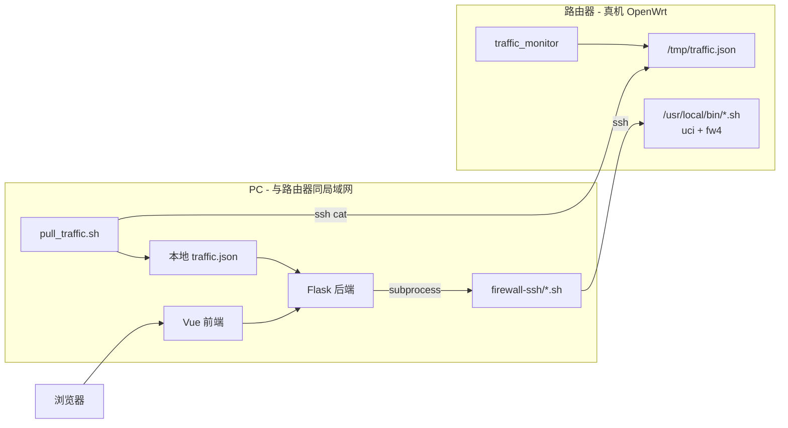
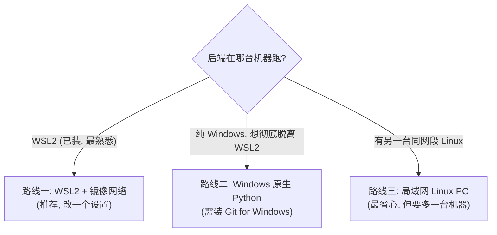

# router-bridge：让 PC 后端对接真机路由器（方案 A 完整教程）

> 解决的问题：路由器只有 16MB flash，**装不下 Python/Flask**。所以后端跑在 PC 上，
> 路由器只负责"采集流量（C 程序）+ 执行防火墙（uci/fw4 脚本）"。本目录是连接
> 二者的"桥"。

---

## 0. 先回答一个常见疑问：还需要虚拟机 / VMware 吗？

**简短回答：到这一步，VMware 里的那台 OpenWrt 虚拟机已经可以不要了。**

之前那台 OpenWrt VM 的作用，是在没有真路由器时**假装**成一台 OpenWrt 设备，供你们测 C 程序、测防火墙脚本、跑真实模式后端。现在你们有了**真路由器**，它就是货真价实的 OpenWrt 设备，VM 的使命结束。

把"开发/构建"和"运行/演示"分开看：

| 用途 | 还需要什么 | VMware OpenWrt VM | WSL2 |
|---|---|---|---|
| **运行 / 演示**（后端 + 前端 + 真机） | 一台能上网、能 SSH 到路由器的电脑 | ❌ 不需要 | 可要可不要（见下） |
| **重新交叉编译 C 程序**（改了 C 代码才需要） | 一个 Linux + OpenWrt SDK | ❌ 不需要 | ✅ 需要（SDK 只能在 Linux 跑） |

结论：

- **VMware 那台 OpenWrt 虚拟机：可以关掉/删掉了**，真机取代了它。
- **WSL2：建议保留**，但它不是"特殊环境"——它本来就装着，而且：
  - 只有在你**再次修改 C 代码、需要重新交叉编译**时才用得上（OpenWrt SDK 是 Linux 工具）。
  - 跑后端这件事，WSL2 和纯 Windows 都行（见 §3 的两条路线）。
- 交叉编译出来的二进制已经在路由器上了，**日常运行/演示完全不依赖任何虚拟机**。

> 一句话：**真机 = OpenWrt 环境，PC = 后端+前端，VMware 可以退役；WSL2 只在"重新编译 C 程序"时才需要。**

---

## 1. 为什么需要这座"桥"

PC 上的 Flask 后端在 `MOCK_MODE=false` 下做两件事，但它们的真实数据/能力都在路由器上：

| 后端动作 | 默认行为 | 问题 | 本桥的解法 |
|---|---|---|---|
| `GET /api/traffic` | 读本地文件 `TRAFFIC_JSON_PATH` | C 程序把 JSON 写在**路由器**的 `/tmp/traffic.json` | `pull_traffic.sh` 把它定时拉到 PC |
| `/api/firewall/*` | `subprocess` 跑本地脚本 | `uci`/`fw4` 只在**路由器**上有 | `firewall-ssh/*.sh` 把调用 SSH 转发到路由器 |



桥的关键是**后端代码几乎零改动**：后端仍然"读一个本地文件"+"跑几个本地脚本"，只不过那个文件是拉下来的、那些脚本内部会 SSH 到路由器。

> 注：后端的 `_run_script` 已做跨平台处理——在 Windows 上会自动用 `bash` 来跑 `.sh`
> 包装脚本（需装 Git for Windows，见 §3 路线二）。Linux/WSL2 上行为不变。

---

## 2. 第一步（必做）：路由器侧准备

你同伴交叉编译时可能只传了 `traffic_monitor`，但**防火墙脚本是 shell、不用编译，也必须传上去**。在能 SSH 到路由器的机器上执行（路由器 IP 以实际为准，下文统一用 `192.168.1.1`）：

```bash
# 1) 把 4 个防火墙脚本传到路由器
scp firewall-scripts/*.sh root@192.168.1.1:/usr/local/bin/

# 2) 在路由器上赋可执行权限 + 去掉可能的 Windows 换行符
ssh root@192.168.1.1 'chmod +x /usr/local/bin/*.sh; sed -i "s/\r$//" /usr/local/bin/*.sh'

# 3) 确认流量程序在运行并持续写 JSON（没在跑就先启动它）
ssh root@192.168.1.1 'ps | grep traffic_monitor | grep -v grep'
ssh root@192.168.1.1 '/usr/local/bin/traffic_monitor -i br-lan -t 1000 -o /tmp/traffic.json &'
ssh root@192.168.1.1 'sleep 2; cat /tmp/traffic.json | head'
```

逐项确认：

- [ ] 路由器上有 `/usr/local/bin/traffic_monitor`（MIPS 版）且在运行、在写 `/tmp/traffic.json`
- [ ] 路由器上有 `/usr/local/bin/{add_rule,del_rule,list_rules,clear_rules}.sh` 且可执行
- [ ] `ssh root@192.168.1.1 /usr/local/bin/list_rules.sh` 能输出 `{"rules":[...]}`
- [ ] 网卡名对（`br-lan` 还是别的，用 `ssh root@192.168.1.1 ip addr` 看）

---

## 3. 第二步：选一台机器跑后端（关键，含网络坑解决）

后端要能 **SSH 到路由器**。难点在于：如果后端跑在 **WSL2** 里，WSL2 默认是 NAT 网络，
**访问不到**和 Windows 主机同网段的路由器（如 `192.168.1.1`）。下面给三条路线，**按推荐度排序**。



> 谁的电脑连着路由器，就在谁的电脑上跑后端（一般是拿着路由器的 Role B）。

---

### 路线一（推荐）：WSL2 + 镜像网络（mirrored）

WSL2 里 `.sh`、`ssh`、`python` 本来就都能用，唯一缺的是"能不能连到路由器"。
打开**镜像网络模式**后，WSL2 直接共享 Windows 的网卡，就能访问 `192.168.1.1` 了。
**前提：Windows 11 22H2 及以上**（镜像模式才有）。Windows 10 用不了镜像，请走路线二或三。

**步骤：**

1. 在 Windows 上编辑（没有就新建）文件 `C:\Users\<你的用户名>\.wslconfig`，写入：

   ```ini
   [wsl2]
   networkingMode=mirrored
   ```

2. 在 **Windows PowerShell** 里重启 WSL2：

   ```powershell
   wsl --shutdown
   ```

   等几秒后重新打开 WSL2 终端。

3. 验证 WSL2 现在能连到路由器：

   ```bash
   ip addr            # 现在应能看到和 Windows 同网段的地址
   ping -c1 192.168.1.1
   ```

4. 配置 WSL2 到路由器的免密 SSH（OpenWrt 用 dropbear，公钥放 `/etc/dropbear/authorized_keys`）：

   ```bash
   ls ~/.ssh/id_ed25519.pub 2>/dev/null || ssh-keygen -t ed25519 -N "" -f ~/.ssh/id_ed25519
   # WSL2/Linux 一般有 ssh-copy-id，直接用：
   ssh-copy-id root@192.168.1.1
   # 若没有 ssh-copy-id，用这条手动追加公钥：
   cat ~/.ssh/id_ed25519.pub | ssh root@192.168.1.1 'mkdir -p /etc/dropbear && cat >> /etc/dropbear/authorized_keys'
   # 验证：不再要密码
   ssh root@192.168.1.1 'echo ok'
   ```

5. 跑起来（见 §4，用 bash 直接跑本目录脚本即可）。

---

### 路线二：纯 Windows 原生 Python（彻底不用 WSL2 跑后端）

适合"就想在 Windows 上双击跑起来"。代价：要装 Python 和 Git for Windows。
（Git for Windows 同时提供了 `bash` 和 `ssh`，后端跑 `.sh` 包装脚本要靠它。）

**一次性安装：**

1. **Python 3**：到 python.org 下载安装，**勾选 "Add Python to PATH"**。验证：`python --version`。
2. **Git for Windows**：到 git-scm.com 下载安装（默认选项即可）。它带来 `bash` 和 `ssh`。
   验证（在新开的 PowerShell 里）：`bash --version`、`ssh -V`。
   > 后端在 Windows 上会自动用这个 `bash` 去执行 `firewall-ssh/*.sh`；没有它会报错提示。

**拿到代码（在 Windows 上，不必经 WSL2）：**

```powershell
cd $env:USERPROFILE
git clone git@github.com:Stevie-1/MyOpenWrt.git ComputerNetworkExp
cd ComputerNetworkExp
git pull origin main
```

**装后端依赖（建议用虚拟环境）：**

```powershell
python -m venv .venv
.\.venv\Scripts\Activate.ps1
pip install -r backend\requirements.txt
```

**配置 Windows 到路由器的免密 SSH**（Windows 10/11 自带 OpenSSH 客户端；没有 `ssh-copy-id`，手动追加）：

```powershell
# 没有 key 才生成（默认在 %USERPROFILE%\.ssh\id_ed25519）
ssh-keygen -t ed25519
# 把公钥追加到路由器（OpenWrt 用 dropbear）
type $env:USERPROFILE\.ssh\id_ed25519.pub | ssh root@192.168.1.1 "mkdir -p /etc/dropbear && cat >> /etc/dropbear/authorized_keys"
# 验证：不再要密码
ssh root@192.168.1.1 "echo ok"
```

**跑起来：** 见 §4 的"Windows 跑法"。

> Windows 网络默认就和路由器同网段，所以**没有 WSL2 那个 NAT 坑**，`ssh root@192.168.1.1`
> 直接通。这也是为什么纯 Windows 路线在"连路由器"这点上反而最简单。

---

### 路线三：另一台同网段的 Linux PC

如果手头有一台和路由器接同一个交换机/路由的 Linux 机器，直接在它上面 `git clone` + 跑后端最省心：没有 WSL2 NAT 问题、`.sh` 原生可跑。步骤同路线一的第 4-5 步（跳过镜像网络设置）。

---

## 4. 第三步：启动桥 + 后端 + 前端

路由器 IP 假设 `192.168.1.1`。**所有命令在仓库根目录执行。**

### Linux / WSL2 跑法（路线一、三）

开三个终端：

```bash
# 终端1：持续把路由器的流量 JSON 拉到 PC（默认落地 /tmp/router-traffic.json）
ROUTER_HOST=192.168.1.1 ./scripts/router-bridge/pull_traffic.sh /tmp/router-traffic.json

# 终端2：起后端（真实模式：流量读拉下来的文件，防火墙走 SSH 转发）
ROUTER_HOST=192.168.1.1 ./scripts/router-bridge/start_backend.sh

# 终端3：前端（也可在别的机器，只要能访问这台 PC 的 5000 端口）
cd frontend && pnpm install && pnpm dev
```

`start_backend.sh` 等价于手动设这些环境变量再 `python3 app.py`：

```bash
export MOCK_MODE=false
export TRAFFIC_JSON_PATH=/tmp/router-traffic.json
export FIREWALL_SCRIPTS_DIR="$PWD/scripts/router-bridge/firewall-ssh"
export ROUTER_HOST=192.168.1.1
cd backend && python3 app.py
```

### Windows 跑法（路线二）

`pull_traffic.sh` 是 shell 脚本，用 **Git Bash** 跑；后端用 **PowerShell** 跑。

1. **Git Bash 窗口**（开始菜单搜 "Git Bash"），拉流量：

   ```bash
   cd /c/Users/<你>/ComputerNetworkExp
   ROUTER_HOST=192.168.1.1 ./scripts/router-bridge/pull_traffic.sh /c/Users/<你>/router-traffic.json
   ```
   > Git Bash 里 `/c/Users/...` 就是 Windows 的 `C:\Users\...`。

2. **PowerShell 窗口**，起后端（注意 `TRAFFIC_JSON_PATH` 要和上面落地路径指同一个文件）：

   ```powershell
   cd $env:USERPROFILE\ComputerNetworkExp
   .\.venv\Scripts\Activate.ps1
   $env:MOCK_MODE = "false"
   $env:TRAFFIC_JSON_PATH = "$env:USERPROFILE\router-traffic.json"
   $env:FIREWALL_SCRIPTS_DIR = "$env:USERPROFILE\ComputerNetworkExp\scripts\router-bridge\firewall-ssh"
   $env:ROUTER_HOST = "192.168.1.1"
   cd backend
   python app.py
   ```

3. **前端**（任意终端）：`cd frontend; pnpm install; pnpm dev`。

---

## 5. 第四步：验证整条链路通了

```bash
curl http://localhost:5000/api/health            # mockMode 应为 false
curl http://localhost:5000/api/traffic           # 来自真机的真实流量
curl http://localhost:5000/api/firewall/rules    # 经 SSH 列真机规则
# 加一条规则（真机上真的会生效）
curl -X POST -H 'Content-Type: application/json' \
  -d '{"proto":"tcp","src":"any","dst":"192.168.1.1","port":80,"action":"drop"}' \
  http://localhost:5000/api/firewall/rules
# 在路由器上核对
ssh root@192.168.1.1 'fw4 print | grep -A3 webfw'
```

浏览器打开前端，走一遍 **增 → 列 → 删 → 清**，同时在路由器 `fw4 print` 里看到规则随之
变化、被 drop 的设备真的访问不了目标——这就是 +10 分的完整证据链，记得截图/录屏。

---

## 6. 排错速查

| 现象 | 原因 | 处理 |
|---|---|---|
| WSL2 里 `ssh 192.168.1.1` 不通 | WSL2 默认 NAT | 开镜像网络（路线一）或改用 Windows/局域网 Linux（路线二/三） |
| 镜像网络设了还是不通 | Windows 版本 < 11 22H2 | 镜像模式不支持，走路线二/三 |
| `ssh` 每次要密码 | 免密没配好 | 重做 §3 的 `authorized_keys` 步骤；OpenWrt 公钥在 `/etc/dropbear/authorized_keys` |
| Windows 后端报 `no bash/sh found` | 没装 Git for Windows | 装 Git for Windows，重开终端让 `bash` 进 PATH |
| `/api/traffic` 一直空 | 流量没拉过来 / C 程序没跑 | 看 `pull_traffic.sh` 有没有报错；确认路由器上 traffic_monitor 在写 `/tmp/traffic.json` |
| `/api/firewall/rules` 500 | SSH 转发失败 | 手动 `ssh root@路由器 /usr/local/bin/list_rules.sh` 看报错；多半是免密或脚本没传 |
| 加规则 500、提示 fw4 | 路由器固件不是 fw4 | 路由器需 OpenWrt 22.03+（fw4/nftables） |
| `pull_traffic.sh` 在 PowerShell 跑不了 | 它是 .sh | 用 Git Bash 跑（路线二） |
| 前端能开但拿不到数据 | proxy 没指向后端 | `frontend/vite.config.js` 的 proxy target 指向这台 PC 的 `:5000` |

---

## 7. 环境变量一览

| 变量 | 默认 | 用在哪 | 说明 |
|---|---|---|---|
| `ROUTER_HOST` | （必填） | 桥脚本 | 路由器 IP |
| `ROUTER_USER` | `root` | 桥脚本 | SSH 用户 |
| `ROUTER_PORT` | `22` | 桥脚本 | SSH 端口 |
| `REMOTE_PATH` | `/tmp/traffic.json` | pull_traffic | 路由器上 C 程序输出路径 |
| `INTERVAL` | `1` | pull_traffic | 拉取间隔秒数 |
| `TRAFFIC_JSON_PATH` | `/tmp/router-traffic.json` | 后端 | PC 本地落地路径（后端读它，要和 pull 落地路径一致） |
| `FIREWALL_SCRIPTS_DIR` | 本目录的 `firewall-ssh/` | 后端 | 后端找转发脚本的目录 |
| `MOCK_MODE` | `true` | 后端 | 对接真机必须设 `false` |

---

## 8. 文件清单

```
scripts/router-bridge/
├── README.md                  # 本文件
├── pull_traffic.sh            # 定时把路由器 /tmp/traffic.json 拉到 PC
├── start_backend.sh           # 一键设好环境变量起 Flask（Linux/WSL2 用）
└── firewall-ssh/              # 把 FIREWALL_SCRIPTS_DIR 指向这里
    ├── add_rule.sh            # 4 个转发脚本：内部 ssh 到路由器跑同名真脚本，
    ├── del_rule.sh            #   exit code / stdout / stderr 全透传，
    ├── list_rules.sh          #   所以 not-found→404 等映射照常工作
    └── clear_rules.sh
```
